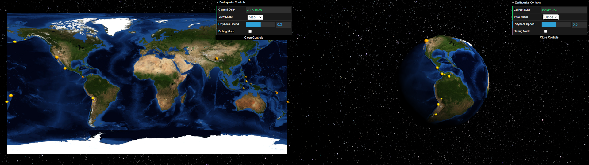

# Earthquake Visualization


This Earthquake Visualizer uses data from NASA and USGS to visualize on a globe the locations where earthquakes happened between 1905 and 2007. It morphs between two complementary views of the data, a 2D map view and a 3D globe view, by using the GUI in the top right corner. 

In order to create the globe, a set of normal vectors and texture coordinates had to be defined for the 2D plane as well as the 3D sphere. The map texture was applied to the meshes by creating a corresponding vertex buffer for each mesh. The morphing and earthquake spawning animations were created by using linear interpolation.

## Prerequisites

To work with this code, you will first need to install [Node.js 16.17.0 LTS](https://nodejs.org/). 

## Getting Started
Pull the dependencies from the node package manager with:

```
npm install
```
After that, compile and run a server with:

```
npm run start
```

Webpack should launch your program in a web browser automatically.  If not, you can run it by pointing your browser at `http://localhost:8080`.

## Acknowledgments

This assignment was based on content from CSCI 4611 Fall 2021 by [Daniel Keefe](https://www.danielkeefe.net/).

## License

Material for [CSCI 4611 Fall 2022](https://csci-4611-fall-2022.github.io/) by [Evan Suma Rosenberg](https://illusioneering.umn.edu/) is licensed under a [Creative Commons Attribution-NonCommercial-ShareAlike 4.0 International License](http://creativecommons.org/licenses/by-nc-sa/4.0/).
